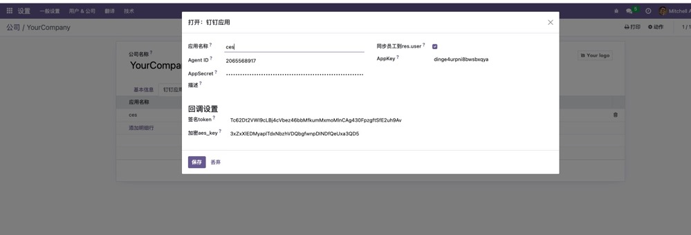
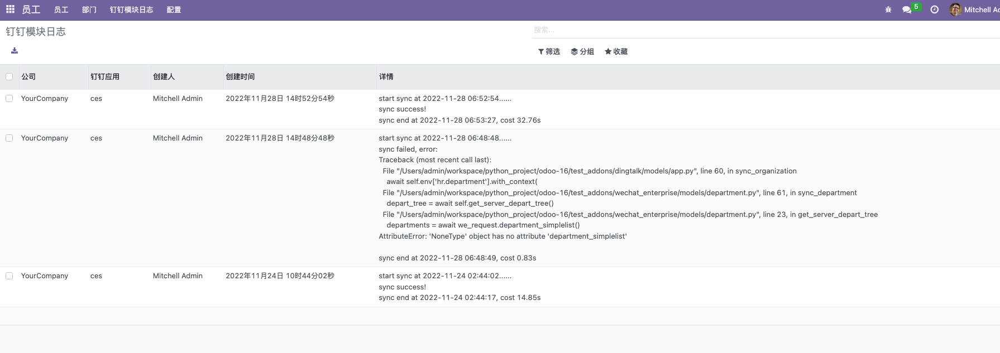

# xy_dingtalk
适用于Odoo16版本的钉钉模块

  

## ✨ 特点

- 采用python升级特性协程进行同步，速度比多线程更快。同步50人公司组织架构只需20s左右
- 仅inherit了少量model，避免多层inherit冗余嵌套影响加载性能
- 支持Odoo多公司切换，每个公司可设置多个钉钉应用
- 兼容企业微信模块，可与[企业微信模块](https://github.com/xunonxyz/xy_wechat)一起安装共存
- 使用Hr模块为基础进行员工管理，而不是直接res.users，充分利用Odoo原生模块功能
- 完整的i18n简中翻译，默认使用英文
- 包含钉钉内建应用必备功能，去掉了其余冗余而普遍用不上的功能，减少模块大小

## 🖥 环境支持

- Odoo16版本
- postgresql12及以上版本（Odoo16的hr模块中使用了Json字段，需要数据库有Json函数支持）
- python3.7及以上（使用了协程特性）
- 安装python的`aiohttp`和`pycrypto`库

## 📦 安装

在Odoo的应用里找到`DingTalk`模块激活即可安装，安装后模块名称翻译会被加载变成「钉钉」

## ✨ 包含功能

|                功能名称                |             是否支持             |
| :------------------------------------: | :------------------------------: |
|             多公司用户切换             |                √                 |
|     钉钉应用access_token获取并缓存     |                √                 |
|    钉钉应用通讯录部门、成员一键同步    |                √                 |
|      钉钉通讯录部门、成员变更回调      | 有点回调问题，正在钉钉提工单核实 |
| 钉钉二维码扫码登录系统(有widget可使用) |                √                 |
|          钉钉网页跳转登录系统          |                √                 |
|             向钉钉上传素材             |                √                 |
|           推送钉钉各类型消息           |                √                 |

## 🔨 使用

### 配置钉钉应用参数

在「Odoo系统 - 设置 - 用户&公司」页面，选中公司后切换到「钉钉应用」选项卡进行参数配置

注：如果勾选了应用中的「同步员工到res.user」则在保存hr.employee记录时也会创建res.users记录，否则仅创建hr.employee

### 同步

配置完参数后点击「同步组织架构」按钮即可。同步是在后端异步进行，不会阻塞当前操作，但尽量不要进行用户、部门的变更、创建、删除等操作。

同步完成或失败后均会有通知窗进行通知。  

### 同步日志

每次同步的结果、报错代码栈、花费的时间等信息均可以进行查看。

在「员工 - 钉钉模块日志」页面可进行查看  

## ❤️ 支持

富能通企业官网：https://www.funenc.com/

免费后端培训视频系列：https://www.bilibili.com/video/BV1rP411G7CZ/

知识星球Odoo源码解读：

更多模块或进群交流欢迎加微信: 

